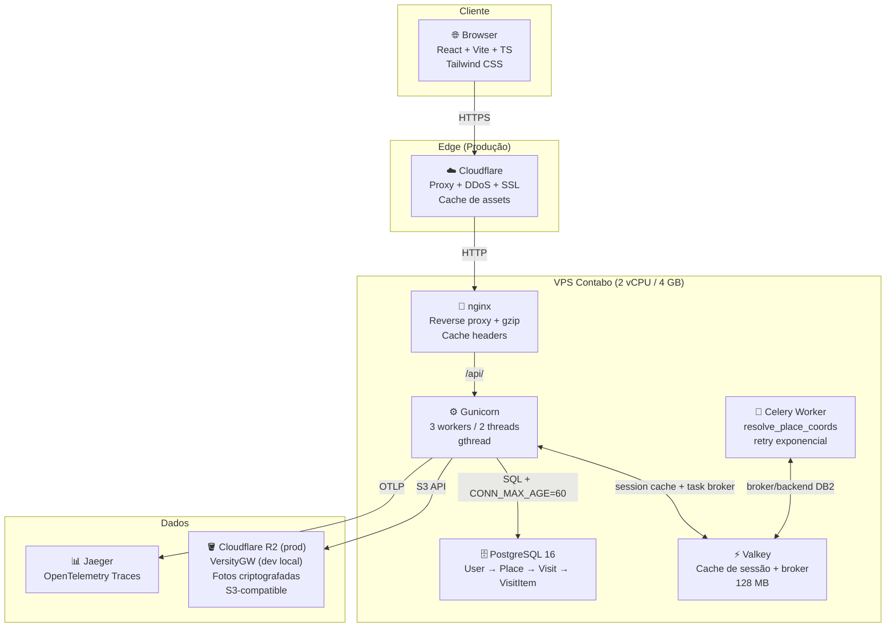

# Arquitetura

## Diagrama



## Stack

| Camada | Tecnologia |
|--------|-----------|
| Frontend | React 19 + Vite + TypeScript + Tailwind CSS |
| Backend | Django 5 + Django REST Framework + SimpleJWT |
| Cache / Broker | Valkey 9 (session cache, throttling, Celery broker DB2) |
| Task queue | Celery (resolve coords assíncrono, retry exponencial) |
| Database | PostgreSQL 16 (local e produção) |
| Storage | VersityGW (desenvolvimento local) → Cloudflare R2 (produção) |
| Observability | Jaeger + OpenTelemetry + Sentry |
| Auth | JWT com refresh rotation + single-session por usuário |
| Servidor | Gunicorn gthread (3w × 2t) atrás de nginx |
| Testing | pytest + Vitest + Playwright |

## Ambientes

- Desenvolvimento local:
  - `docker-compose.yml`
  - PostgreSQL + Valkey + VersityGW + Jaeger
  - frontend em Vite ou nginx local
- Produção:
  - `docker-compose.prod.yml`
  - frontend container com nginx
  - backend Django + Gunicorn
  - `celery-worker`
  - PostgreSQL e Valkey na própria VPS
  - Cloudflare na borda
  - Cloudflare R2 para mídias

## Modelo de Dados

```
User
 └── Place (name, description, address, status, cover_photo, maps_url, lat/lng, coords_status)
      └── Visit (date, rating_env, rating_service, rating_exp, photo, notes)
           └── VisitItem (name, type, price, rating, photo, description)
```

- `id` = PK interno (FK joins). `public_id` = UUID exposto em todas URLs/payloads.
- Ratings: escala 0–10 (inteiros).
- Status do lugar: `want` / `visited` / `favorite` / `wont_return`.
- `coords_status`: `pending` → `resolved` | `failed` — controlado pela task Celery `resolve_place_coords`.
- Paginação: 20 itens/página em todos os list endpoints.

## Autenticação

- SimpleJWT com `ROTATE_REFRESH_TOKENS=True`. Logout blacklista o refresh token.
- Tokens em `localStorage` (tradeoff aceito: XSS vs CSRF). TTL access=30min.
- **Single-session**: `UserSession` por usuário com `session_key` rotativo no JWT, validado por `SingleSessionJWTAuthentication`. Novo login invalida sessão anterior.
- Valkey cache do `session_key` com TTL=270s — evita DB hit em cada request autenticado.
- Password hashing: Argon2 primeiro, PBKDF2 como fallback (re-hash transparente no próximo login).
- **Throttle**: login/register/me usam `AuthRateThrottle` (scope `auth`, 10/min). CIDRs privados isentos via `THROTTLE_EXEMPT_CIDRS`.
- Google OAuth: `POST /api/auth/google/` com `{ id_token }`. Troca de senha bloqueada para contas Google.

## Imagens

- Salvas via `core.image_service.ImageService` — nunca direto no ImageField.
- Path: `users/{user_id}/{category}/{sha256[:16]}_{timestamp_ms}` (sem extensão, não identificável).
- Criptografia Fernet por usuário: `HKDF(SHA256, salt=b"bora-ali-media-v1", info=user_id, ikm=SECRET_KEY)`.
- Servidas em `GET /api/media/<path>` — autentica JWT, confere `user_id` no path, descriptografa, stream. Retorna 404 para arquivo errado ou de outro usuário (nunca 403).
- `post_delete` signals em `accounts/signals.py` e `places/signals.py` chamam `ImageService.delete()`.

## Estrutura de Arquivos

```
bora-ali/
├── backend/
│   ├── config/         # settings.py, urls.py, wsgi.py, celery.py, telemetry.py, admin_site.py, test_settings.py
│   ├── core/           # utilitários compartilhados (não em INSTALLED_APPS)
│   │   ├── exceptions.py / exception_handler.py
│   │   ├── validators.py       # validate_image_upload(), validate_safe_url()
│   │   ├── image_service.py    # ImageService
│   │   └── media_views.py      # serve_user_media
│   ├── accounts/       # UserSession, UserProfile, GoogleIdentity, SingleSessionJWTAuthentication
│   │   ├── authentication.py
│   │   ├── throttles.py        # AuthRateThrottle
│   │   └── signals.py          # cleanup_profile_photo (post_delete)
│   ├── places/         # Place (CoordsStatus), Visit, VisitItem
│   │   ├── managers.py         # QuerySets com select_related
│   │   ├── signals.py          # cleanup de fotos via transaction.on_commit
│   │   ├── tasks.py            # resolve_place_coords (Celery, bind=True, max_retries=3)
│   │   └── maps.py             # extract_coords() — regex para lat/lng do Google Maps
│   └── entrypoint.sh   # migrate + compilemessages → exec gunicorn (PID 1)
├── frontend/
│   └── src/
│       ├── routes/     # LoginPage, RegisterPage, PlacesPage, PlaceDetailPage, ...
│       ├── components/ # ui/, places/, visits/
│       ├── services/   # api.ts, api-errors.ts, auth/places/visits/visit-items.service.ts
│       ├── contexts/   # AuthContext.tsx, useAuth.ts, auth.ts
│       ├── utils/      # client-state.ts, places-state.ts, formatters.ts
│       └── i18n/       # index.ts (react-i18next setup)
├── docs/
│   ├── superpowers/    # planos de implementação (uso interno)
│   ├── architecture.md
│   ├── development.md
│   └── testing.md
├── scripts/
│   ├── test_nginx_security.sh   # audit headers/segurança nginx
│   ├── ngrok-preprod.sh         # túnel ngrok para preprod
│   └── po-to-i18n.cjs           # converte .po → JSON para frontend i18n
├── docker-compose.yml
├── CLAUDE.md
└── README.md
```

## Docker Compose — Serviços Locais

| Serviço | URL local | Notas |
|---------|-----------|-------|
| Frontend (nginx) | `http://localhost` | SPA + proxy `/api/` |
| API | `http://localhost/api/` | Django via nginx |
| Health check | `http://localhost/api/health/` | sem auth, sem DB |
| PostgreSQL | `localhost:5432` | — |
| Valkey | `localhost:6379` | — |
| Jaeger UI | `http://localhost:16686` | traces OTLP |
| VersityGW S3 API | `http://localhost:8081` | `AccessDenied` na raiz é esperado |
| VersityGW WebGUI | `http://localhost:8082` | — |
| Celery worker | — | sem porta exposta; logs via `docker compose logs -f celery` |

**Profile `security`** (não sobe por padrão): `zap-api-scan`, `zap-baseline`, `httpx-security`.
```bash
docker compose --profile security run --rm zap-api-scan
```

## Topologia de Produção

- Edge: Cloudflare faz DNS, proxy reverso, TLS, bypass de cache para `/api/*` e Turnstile.
- Compute: Contabo VPS roda os containers do [docker-compose.prod.yml](/home/smovisk/PycharmProjects/bora-ali/docker-compose.prod.yml).
- Dados:
  - PostgreSQL fica no próprio stack da VPS.
  - Valkey fica no próprio stack da VPS.
  - mídias vão para Cloudflare R2 via S3-compatible API.
- O backend alterna o storage pela configuração:
  - `USE_VERSITYGW=True` para dev local
  - `USE_VERSITYGW=False` + endpoint HTTPS S3 para R2 em produção
